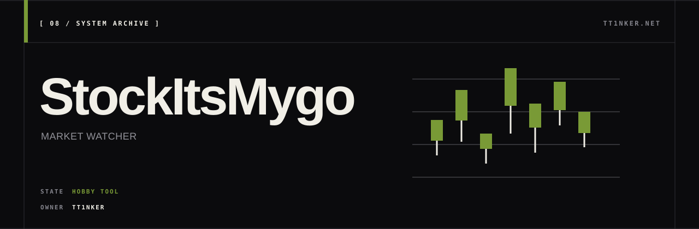

<p align="center">
  
</p>

<p align="center">
  <a href="https://ttinker.net">ttinker.net</a> ·
  <a href="docs/MASTER_README.md">documentation</a> ·
  <a href="docs/ARCHITECTURE.md">architecture</a>
</p>

# StockItsMygo

个人使用的股票数据、watchlist 和技术指标实验台。它可以运行，但不是投资产品，也没有生产级安全边界。

| State | Evidence | Current boundary |
| --- | --- | --- |
| Hobby tool | Python test files, PostgreSQL/TimescaleDB schema, working Flask dashboard | No CI, complete backtest, rate limiting, or audit log; default credentials and invite code must be replaced before any deployment |

---

## ✨ 核心功能

| 功能 | 描述 |
|------|------|
| 📊 **技术指标推荐** | 基于 RSI、动量、量能等多维度技术分析的每日 mover / 打分 |
| 👁️ **Watchlist** | 4 种仓位类型（Long / Short / Watch / Wishlist），自动收益计算 |
| 🔐 **多用户系统** | 邀请码注册，独立 watchlist，PBKDF2-SHA256 密码 |
| 📈 **历史数据基建** | 全美股 ~2,000 标的批量入库；TimescaleDB hypertable 加速时序查询 |
| ⚡ **数据 ingestion** | yfinance（美股，main）· AKShare + Baostock（A 股，`cn-a-shares` branch） |

---

## 🚀 快速开始

需要：**Docker (compose v2)** + **Python 3.10+**。

```bash
git clone https://github.com/TT1nKer/StockItsMygo.git
cd StockItsMygo

# 1. 起 TimescaleDB 容器（5432，数据卷 ./pg-data/）
docker compose up -d

# 2. Python 环境
python -m venv venv && source venv/bin/activate   # Linux / macOS
# Windows PowerShell: venv\Scripts\Activate.ps1
pip install -r requirements.txt

# 3. 初始化 17 张表 + 内置 admin 用户
STOCK_DB_TYPE=postgresql python db/init_db_postgres.py

# 4. 启动 Web 仪表板（默认 :8090）
STOCK_DB_TYPE=postgresql python web_dashboard.py
```

浏览器打开 `http://localhost:8090`，登录 `admin` / `admin123`（**首次登录立即改密码**）。

> ⚠️ **数据需要自己拉**：以上只建好空 schema。要看实际数据：
> - 增量更新最近 N 天：`python tools/update_recent_data.py --days 30 --yes`
> - 全量下载（耗时数小时）：`python tools/download_all_stocks.py`

### Windows 注意

PowerShell 里这样设环境变量：

```powershell
$env:STOCK_DB_TYPE = "postgresql"
$env:DASHBOARD_PORT = "8090"
python web_dashboard.py
```

`config/paths.py` 已经按 `platform.system()` 分支，Windows 下走 `d:/strategy=Z`（可在该文件里改）。

---

## 🔧 配置（环境变量）

所有连接 / 端口都通过 env 覆盖，源码无硬编码。

| 变量 | 默认 | 作用 |
|---|---|---|
| `STOCK_DB_TYPE` | `sqlite` | `sqlite` 或 `postgresql` |
| `STOCK_PG_HOST` | `localhost` | PG 主机 |
| `STOCK_PG_PORT` | `5432` | PG 端口 |
| `STOCK_PG_USER` | `stock_user` | PG 用户 |
| `STOCK_PG_PASSWORD` | `stock_password` | PG 密码 |
| `STOCK_PG_DATABASE` | `stock_db` | PG 数据库名 |
| `DASHBOARD_PORT` | `8090` | Flask 监听端口（默认从 8080 改到 8090 避开 code-server 冲突） |

---

## 🌿 Branches

| Branch | 市场 | 数据源 | 容器 |
|---|---|---|---|
| `main` | 美股 | yfinance | `strategy-z-pg:5432` → `stock_db` |
| `cn-a-shares` | A 股（沪深主板 + 创业板，~4,600 只） | AKShare 主 + Baostock 备 | `strategy-z-pg-cn:5433` → `stock_db_cn` |

切到 CN：`git checkout cn-a-shares`，然后 `STOCK_PG_PORT=5433 STOCK_PG_DATABASE=stock_db_cn` 启动 dashboard / ingest 脚本。

---

## 🔧 常用命令

```bash
source venv/bin/activate
STOCK_DB_TYPE=postgresql python web_dashboard.py            # 启动 dashboard

# 数据维护
python tools/update_recent_data.py --days 5 --yes           # 增量更新近 5 天
python strategy_recommender_fast.py                          # 跑当日推荐

# cn-a-shares branch:
python tools/cn_backfill.py --workers 64                    # A 股全量 backfill
```

---

## 📚 文档导航

> 👉 **完整文档**：[docs/MASTER_README.md](docs/MASTER_README.md)

- 🚀 [部署指南](docs/deployment/DEPLOYMENT.md)
- 🌐 [网络配置](docs/setup/NETWORK.md) - 局域网 / Tailscale / ngrok
- 👥 [用户认证](docs/setup/AUTHENTICATION.md)
- 📊 [数据库指南](docs/DATABASE_GUIDE.md)
- 👁️ [Watchlist 指南](docs/features/WATCHLIST.md)
- ❓ [FAQ](docs/setup/FAQ.md)

---

## 🎯 技术栈

- **数据库**：PostgreSQL 16 + TimescaleDB（`price_history` 为 hypertable）
- **后端**：Python 3.10+ · Flask · psycopg2 · pandas · numpy
- **前端**：Plotly.js + 服务端模板
- **数据源**：yfinance（美股）· AKShare + Baostock（A 股）
- **运维**：Docker Compose v2 · multiprocessing 并发 ingest

---

## 🔐 安全提示

- ⚠️ 默认 admin 密码 hash 写在 `db/init_db_postgres.py` 里方便首装，**装完立刻改**
- ⚠️ 邀请码 `stocktest2026` 在 `auth.py:12`，部署前改掉
- ⚠️ 定期 `pg_dump stock_db > backup-$(date +%F).sql`

---

## 📌 当前状态 / Limitations

- **状态**：active · 个人使用，非生产级
- **数据**：schema 已建好，**实际数据需要自己用 ingest 脚本拉**；yfinance / AKShare 都有限流
- **推荐**：基于公开 OHLCV 的技术指标，**不构成投资建议**
- **回测**：尚无完整回测框架（roadmap）
- **多用户**：邀请码可用，未做速率限制 / 审计日志

---

**MIT License**

<div align="center">

[📚 完整文档](docs/MASTER_README.md) • [🚀 部署](docs/deployment/DEPLOYMENT.md) • [❓ FAQ](docs/setup/FAQ.md)

</div>
